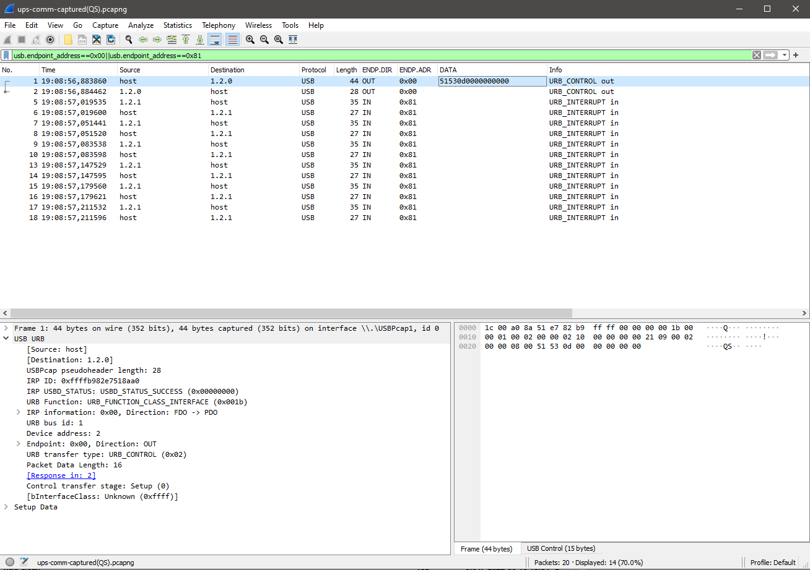
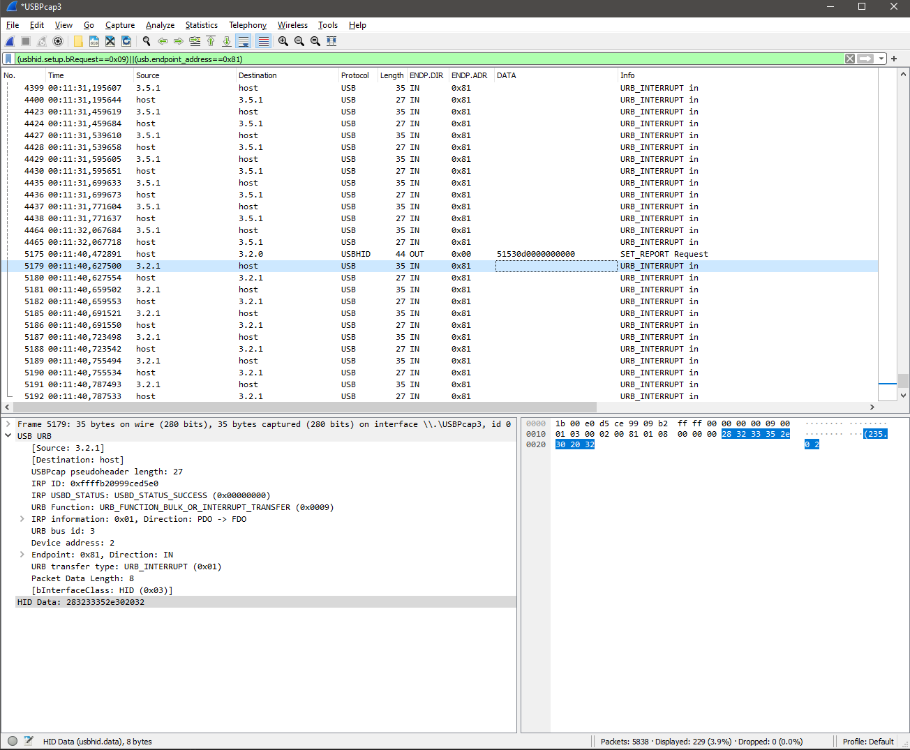
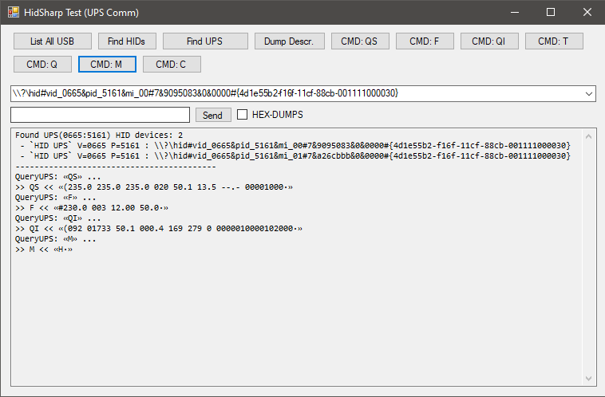
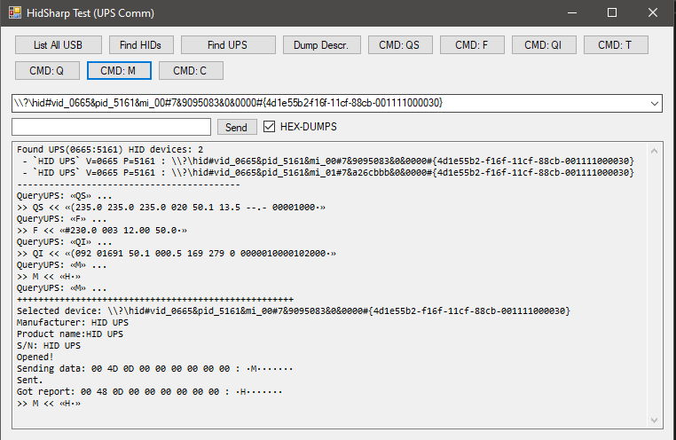

# HidSharp Test - Test app to talk to USB HID UPS
----

This is something to test communication with those cheap USB UPS that use additional data added at end of usb report as transport layer for commands (like it would be a serial port :sweat_smile: ). 
Also some newer models show up in system as 2 devices: 

- Generic HID Device
- HID Battery

The later reports only charge level to system (windows) and is recognized as battery.


But to get a bit more information or control you need a way to communicate with it. 

----
## UPS Models used for tests

I have tested this my app on those:
- ActiveJet AJE-1021 (normal Voltronic-QS **F** protocol)
- Salicru SPS 900 ONE (the Voltronic-QS **F** variation)

----
### "viewPower" Software (the "original" control software)
Since I hate java so the "suggested" software is no-no for me (it's some java-service that talk to ups, and web-server (I think I saw 'tomcat' word) that serve a webpage which act as GUI :expressionless: :vomiting_face: )

It's app that just try various commands and see for which UPS responds.

Application originally use ```URB_CONTROL``` where command is added in data at end, but the UPS firmware is dumb enough :sweat_smile: that it not looking at report type, just check (the extra) data in report for possible command.




I use ```SET_REPORT``` and it works too :grin: 


----
# Voltronic-QS protocol variation ```F```
The UPS I have use a bit modified **Voltronic QS** protocol, which is reported as ```F``` version (for ```M``` command). 

This version doesn't exists in protocols description on [NUT website](https://networkupstools.org/). 

Here is the [Voltronic QS](https://networkupstools.org/protocols/voltronic-qs.html#V-protocol-queries) description, the closest is ```V``` version.

There is ```QI``` command that returns some undefined values (seems like some internal variables/settings...)

----
# Build
Grab HidSharp code, open **sln** (not net-standard), build it (debug/release - your choice). 

Load project, re-add Reference to compiled ```HidSharp.dll```, and build project.

----
# about the app
You can find UPS by clicking ```Find UPS``` it'll look for HID device that have VID ```0x0665``` / PID ```0x5161``` . If there is more than one device in system it'll automatically pick the ```MI_00``` device (this is usually endpoint 0 used for communication).

After pressing command button , command is sent to UPS and program wait about 1sec to pick-up all data - so the form will freeze for a moment.

You can type your own command in TextBox beside button ```Send```, command can have 7 characters at most (9 bytes have buffer, -1 char for CR ```0x0d``` and first byte of buffer is ignored by UPS too => 7 bytes/chars ).
*Maybe in future I'll make this to handle longer commands (send it in multiple chunks) but I don't see a reason to do for now*

CheckBox ```HEX-DUMPS``` enable print-out a bit more of information while working on command & it's response from UPS.







## License
Use it as you like. For HidSharp library check their license...

# EOF