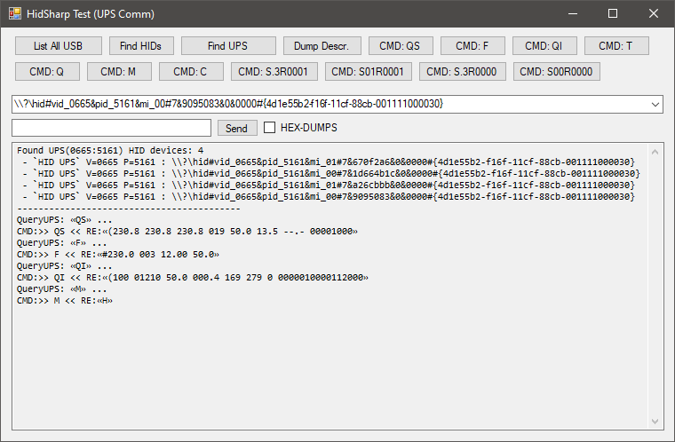
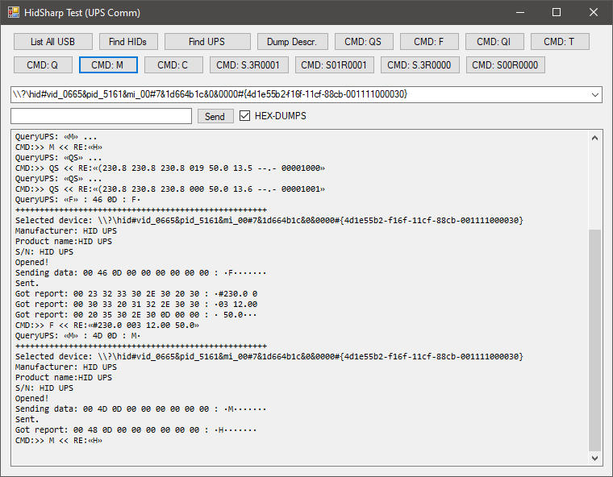

# HidSharp Test - Test app to talk to USB HID UPS
----

This is something to test communication with those cheap USB UPS that use additional data added at end of usb report as transport layer for commands (like it would be a serial port :sweat_smile: ). 
Also some newer models show up in system as 2 devices: 

- Generic HID Device
- HID Battery

The later reports only charge level to system (windows) and is recognized as battery.


But to get a bit more information or control you need a way to communicate with it. 

----
## UPS Models used for tests

I have tested this my app on those:
- ActiveJet AJE-1021 (normal Voltronic-QS **V** protocol)
- Salicru SPS 900 ONE (the Voltronic-QS **H** variation)

----
### "viewPower" Software (the "original" control software)
Since I hate java so the "suggested" software is no-no for me (it's some java-service that talk to ups, and web-server (I think I saw 'tomcat' word) that serve a webpage which act as GUI :expressionless: :vomiting_face: )

It's app that just try various commands and see for which UPS responds.

Application originally use ```URB_CONTROL``` where command is added in data at end, but the UPS firmware is dumb enough :sweat_smile: that it not looking at report type, just check (the extra) data in report for possible command.


I use ```SET_REPORT``` and it works too :grin: 


----
# Voltronic-QS protocol variation ```H```
The UPS I have use a bit modified **Voltronic QS** protocol, which is reported as ```H``` version (for ```M``` command). 

This version doesn't exists in protocols description on [NUT website](https://networkupstools.org/). 

Here is the [Voltronic QS](https://networkupstools.org/protocols/voltronic-qs.html#V-protocol-queries) description, the most similar to **H** is ```V``` version.

There is also ```QI``` command that returns some undefined values (seems like some internal variables/settings...)

----
# Build
Grab HidSharp code, open **sln** (not net-standard), build it (debug/release - your choice). 

Load project, re-add Reference to compiled ```HidSharp.dll```, and build project.

----
# about the app
You can find UPS by clicking ```Find UPS``` it'll look for HID device that have VID ```0x0665``` / PID ```0x5161``` . If there is more than one device in system it'll automatically pick the ```MI_00``` device (this is usually endpoint 0 used for communication).

After pressing command button , command is sent to UPS and program wait about 1sec to pick-up all data - so the form will freeze for a moment.

:warning: :warning: Be careful with **S**-commands - those control UPS output ( "Shutdown" ). You might kill power to your PC :sweat_smile: :warning: :warning:

You can type your own command in TextBox beside button ```Send```, command can have more than 7 chars.

CheckBox ```HEX-DUMPS``` enable print-out a bit more of information while working on command & it's response from UPS.

### Buttons
I believe all are self-explanatory, but oh well:
*(For command description and responses look at linked page with protocol Voltronic-QS description at networkupstools.org )*

- ```List All USB``` - Will list all USB devices,
- ```Find HIDs``` - list only usb devices that are HID-type (e.g. mouse, keyboard, ups, etc...),
- ```Find UPS``` - will only look for USB HID devices that have ,VID:PID==```0665:5161``` and list them into the combobox, also will choose first item that have ```mi_00``` (if it have ; it's refer to device endpoint),
- ```Dump Descr.``` - this will try to read mode info about selected device,
- ```CMD: QS``` - send command to **Query Status** to UPS,
- ```CMD: F``` - send command to request **Feature** - request info with UPS ratings,
- ```CMD: QI``` - send command QI - this is unknown command and what it might be returning,
- ```CMD: T``` - send command to perform 10sec **Test** by UPS,
- ```CMD: Q``` - send command to toggle beeper (it's status is in option bits in QS-response),
- ```CMD: M``` - send command to query UPS for supported protocol, for my UPS it responds with ```H``` (but protocol is basically like ```V```, expect there is no temperature),
- ```CMD: C``` - send command to **Cancel** shutdown (or switch back ON output) - you need to wait at least 10sec to cancel shutdown after the output was switched off,
- ```CMD: S.3R0001``` - send command to shutdown output after 18sec (0.3min), then wait 1min, and restore output back ON,
- ```CMD: S01R0001``` - send command to shutdown output after 1min, then wait 1min, and restore output back ON,
- ```CMD: S.3R0000``` - send command to shutdown output after 18sec (0.3min), and **do not** restore output back (until **Cancel** command is issued),
- ```CMD: S00R0000``` - send command to **INSTANTLY KILL** output, and **do not** restore output back (until **Cancel** command is issued).







## License
Use it as you like. For HidSharp library check their license...

# EOF